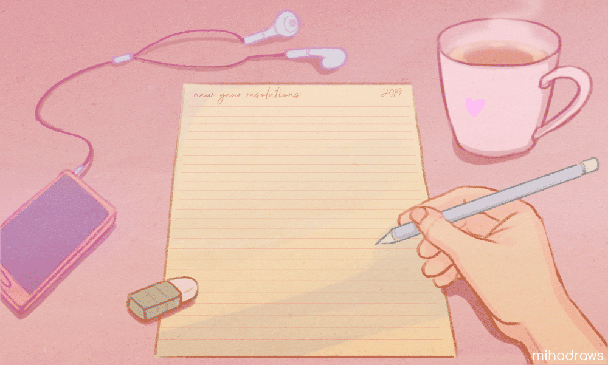

<h1> Hi , My name is Elahe 👋</h1>

  

  

 
<!-- <h2>My skills 🎯🧠</h2> -->

<h2>Connect with me 🔗</h2>

<h2>Github profile stats 📋</h2>

<!--
**ElaheMahmoodi/ElaheMahmoodi** is a ✨ _special_ ✨ repository because its `README.md` (this file) appears on your GitHub profile.

Here are some ideas to get you started:

- 🔭 I’m currently working on ...
- 🌱 I’m currently learning ...
- 👯 I’m looking to collaborate on ...
- 🤔 I’m looking for help with ...
- 💬 Ask me about ...
- 📫 How to reach me: ...
- 😄 Pronouns: ...
- ⚡ Fun fact: ...
-->

